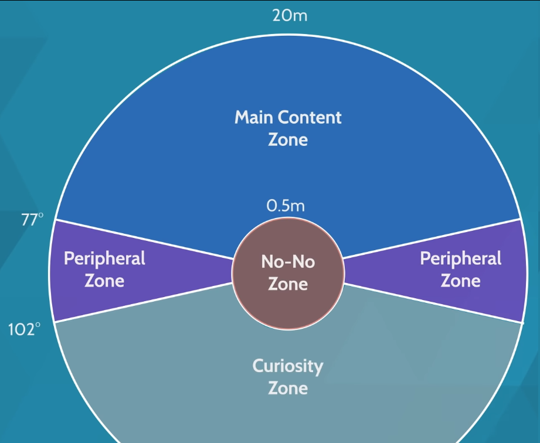

# Seminario Diseño aplicaciones RV

### Generales

1. No hacer que la camara se mueve sin una acción del usuario debido a que puede provocar náuseas, al tu cerebro interpretarlo como un desajuste sensorial.
2. No hacer que la cabeza tambalee mientras el jugador camina. 
3. Menos confusión es mejor para evitar el estrés del usuario, son preferibles los entornos relajantes.
4. Evitar patrones repetitivos como puede ser el suelo ajedrezado.
5. El rendimiento del juego debe ser adecuado a la realidad virtual. La fluidez del juego evita que el cerebro active su mecanismo. Se han de garantizar los 60fps aunque lo óptimo son 90fps. Algunos consejos de optimización son:
    1. Mantenga bajo el número de polígonos en la escena (máximo 100.000)
    2. use sombreadores computacionales ligeros (no pesados) (por ejemplo, evite los sombreadores transparentes si puede)
    3. mantener bajo el número de materiales en la escena
    4. usar atlas de texturas
    5. reducir el número de luces
    6. menor nivel de suavizado
    7. quitar sombras
    8. usar iluminación precalculada
6. Si tu juego es más atractivo, garantizas una presencia más profunda y así el cerebro se concentrará en la historia y no en provocarte náuseas. Es decir, cuanto más inmersivo y entretenido mejor.
7. Haz que los jugadores vean una natriz virtual. Este efecto ayuda al cerebro, posiblemente al tomarla como referencia.
8. Evitar escaleras para reducir la confusión que pueda generar al estar en el mismo sitio.
9. Elegir géneros de juegos que no provoquen mareos de manera natural como juegos de carreras, montañas rusas, etc.

### Interfaz

1. Crea HUD 3D, pues un HUD 2D requiere que el usuario cambie el enfoque para mirar dicha interfaz y luego volver al entorno 3D del juego. Esto crea cansancio en la vista.
2. Usar punteros láser o crecetas para movernos por la GUI.
3. Es necesario ajustar el campo de visión a los ángulos que podemos que podemos rotar e incluinar nuetra cabeza. 
4. Crear un perímetro para que las cosas no estén demasiado cerca y molesten a la hora de mirarla.
    
    
    
5. Utilizar una paleta de colores adecuada para aumentar la inmersión y la naturalidad.
6. Crear una espacio de tres secciones para representar las interfaces, con profundidades diferentes, superponiendose.

### Movimiento

1. El movimiento basado en la teletransportación evita las náuseas pero en cambio hace que el juego sea menos inmersivo.
2. Si tiene un movimiento tradicional, es aconsejable desactivar las aceleraciones en el controlador de su reproductor. Unicamente a de tener dos opciones: quieto o moviendose a una velocidad fija.
3. Reducir el campo de visión (FOV) cuando el jugador se mueva y añadiendo un area negra circundante como si fuese binoculares.
4. Fomentar hardware que pueda hacer que el usuario camine en la realidad y en el juego.
5. Dejar que el usuario eliga como moverse. Es posibles que no todos sufran mareos por lo que para que esté a gusto de todos se recomienda dar libertidad de elección.